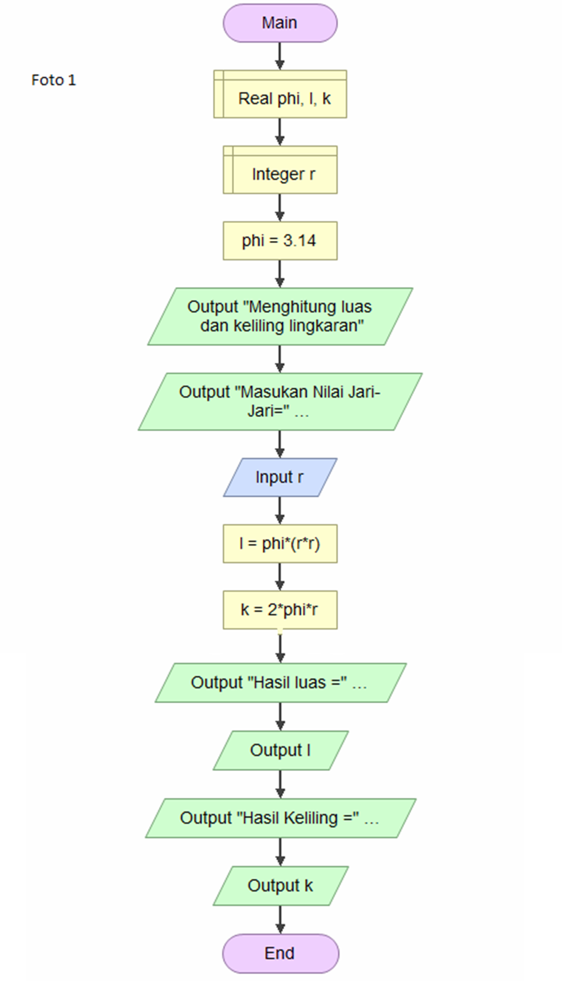
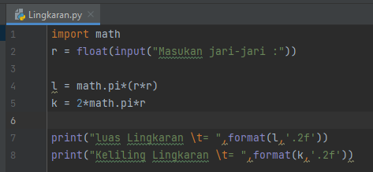

# Labs2
## Membuat Program Menghitung Luas dan Keliling Lingkaran

### Berikut Bentuk dari Flowchartnya

### Berikut adalah contoh kode program luas dan keliling lingkaran
disini kita menggunakan fungsi math, dengan kode math.pi dengan nilai phi 3.14

### Contoh Hasil Output Program

