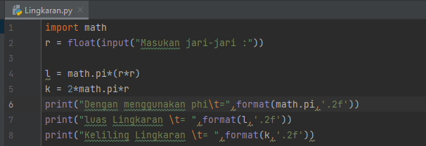
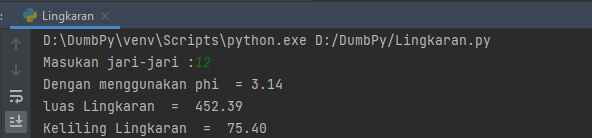

# Labs2
## Membuat Program Menghitung Luas dan Keliling Lingkaran

### Berikut Bentuk dari Flowchartnya

### Berikut adalah contoh kode program luas dan keliling lingkaran
disini kita menggunakan fungsi math, dengan kode math.pi dengan nilai phi 3.14
masukan angka dan program akan menghitung berapa luas dan keliling nya

Menggunakan fungsi format(l,'.2f') untuk menghasilkan 2 angka pecahan
### Contoh Hasil Output Program
